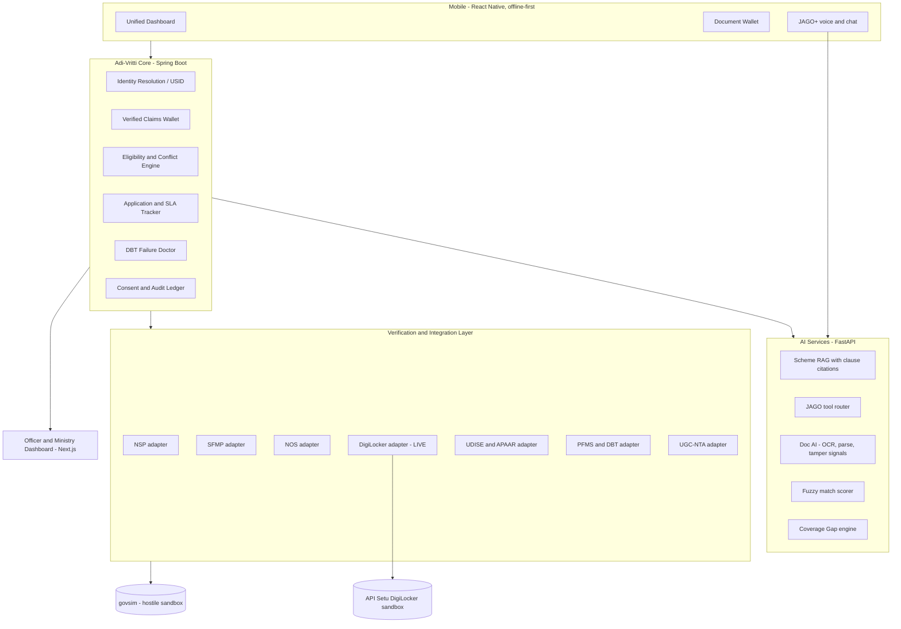

# 1 · Solution Blueprint

## Student journey in one screen

A Post-Matric student opens Adi-Vritti. One scroll shows: **Your scholarships** (all five schemes, with the two she is eligible for highlighted), **where each file is stuck** ("District Nodal Officer — 11 days, SLA is 7"), **₹12,400 received, ₹4,800 pending**, **one pending action** ("income certificate expired for FY 2026-27 — refetch from DigiLocker, 1 tap"), and a mic button that answers in Gondi.

That screen is only possible because of five things happening underneath.

## Architecture



## Layer 1 — Unified Scholar ID

The hard truth: NSP, SFMP and NOS hold records of the same student with no shared primary key. Legacy rows predate OTR entirely. So identity resolution is the first engineering problem, not an afterthought.

**Three-stage resolver:**

1. **Deterministic** — match on OTR (14-digit, Aadhaar-derived) or on an Aadhaar reference key. Confidence 1.0, auto-linked. This covers all post-2024-25 NSP records.
2. **Probabilistic** — for legacy and non-NSP records, a weighted score over normalised name (with Indic transliteration folding — *Meena / Mina / मीना*), DOB, gender, guardian name, institution code, bank account last four, district. Jaro-Winkler on names, exact-or-null on structured fields, Fellegi-Sunter style weights.
3. **Human adjudication** — scores in the 0.60–0.90 band go to an officer review queue with a side-by-side diff and a one-click "same person / different person" decision that feeds back as training signal.

Output is a **USID** plus a link table with confidence and provenance. Two immediate wins fall out for free: the scheme-conflict check becomes possible at all, and **duplicate beneficiaries across systems become visible** — exactly the duplicate-payment problem the CAG audit flagged.

## Layer 2 — Verified Claims Wallet

Today a student uploads the same income certificate to three portals, every year. Replace documents-as-attachments with **claims-as-first-class-objects**.

A claim is `{ usid, claim_type, value, source, method, confidence, verified_at, valid_until, evidence_ref, verifier }`. Once verified, it is reusable across all five schemes until it expires.

| Claim | Tier-1 authoritative source | Validity |
| --- | --- | --- |
| Identity | DigiLocker eKYC / NSP OTR | Per session re-auth |
| ST / PVTG status | State e-District caste certificate via DigiLocker | Lifetime unless flagged |
| Income | e-District income certificate via DigiLocker; ITR-V | 1 financial year |
| Domicile | e-District domicile certificate | Lifetime |
| Academic record | Board / university marksheet in DigiLocker; APAAR-ABC credits | Per exam |
| Enrolment | UDISE+ SDMS for schools, AISHE for HEIs, APAAR | Per academic year |
| Institution validity | AISHE code plus UGC / AICTE recognition; Top Class institution list | Per academic year |
| NET / JRF | UGC-NTA result | Per cycle |
| Disability | UDID | As per UDID card |
| Bank account | PFMS / NPCI Aadhaar-seeding status, penny-drop | Per change |

**The payoff:** renewal — which is the majority of scholarship volume every year — becomes a **zero-document, one-tap confirmation** for any student whose claims are all still valid. That single sentence is worth more to a ministry than any UI polish.

## Layer 3 — Verification Orchestrator

One API: `POST /v1/verify` with a claim type and a subject. Behind it, an ordered strategy chain per claim type, and a hard rule: **a failure never blocks the applicant**.

| Tier | Strategy | Result label |
| --- | --- | --- |
| 1 | Authoritative API call | `gov-verified` |
| 2 | Cross-system corroboration — two independent systems agree | `corroborated` |
| 3 | Doc AI — OCR, field extraction, checksum and tamper signals, issuer-format validation | `assisted` |
| 4 | Manual review queue with a pre-filled officer worksheet | `pending-review` |

Every attempt writes an immutable **provenance record** to an append-only audit ledger, and every mismatch produces an **actionable deficiency**, never a dead end:

> Name on your ST certificate reads *Sunita Meena*; Aadhaar reads *Sunita Kumari Meena*. Pick one: (a) file a name-correction request with the issuing tehsil — we will pre-fill it, (b) upload a gazette notification or affidavit, (c) ask an officer to override with reason. Your application stays live meanwhile.
> 

<aside>
⭐

**The idea that makes this scale — lead with it.** Do not stop at proxying verifications. Make the layer a **credential issuer**: on success it mints a minimal, purpose-bound, **digitally signed attestation** (a JWS / W3C-Verifiable-Credential-shaped object) containing only the assertion — "this USID's family income for FY 2026-27 is under ₹2.5 lakh, verified against e-District on 12 Aug 2026" — with no underlying document attached. NSP, SFMP and NOS can then accept the attestation and skip verification entirely, and it verifies offline from a public key. That is how one hackathon module reduces load on three national portals at once, and it is your strongest "future work progression" answer.

</aside>

Resilience is part of the design, not a footnote: circuit breakers per adapter, retries with jitter, idempotency keys on every write, response cache with per-claim TTL, and explicit **"verification pending — source unavailable"** UI states so a flaky government endpoint degrades the experience instead of breaking it.

## Layer 4 — Eligibility & Conflict Engine

Rules are **data, versioned by academic year**, so a change to an income ceiling is a config edit, not a release. Each rule is evaluated against the claims wallet and returns a reason, not just a boolean.

```json
{
  "scheme": "NOS",
  "academic_year": "2026-27",
  "category": "merit",
  "rules": [
    { "claim": "st_or_pvtg_status", "op": "in", "value": ["ST", "PVTG"], "onFail": "NOS is only for ST and PVTG candidates." },
    { "claim": "family_income_annual", "op": "lte", "value": 600000, "onFail": "Family income must not exceed Rs 6 lakh per annum." },
    { "claim": "qualifying_degree", "op": "exists", "onFail": "Upload or fetch your qualifying degree." }
  ],
  "award_cap": { "total": 20, "pvtg_reserved": 3 }
}
```

The **compatibility matrix** is a separate versioned document — critical, because the policy is mid-change. The PS states one scheme at a time; NSP's current notice permits one merit-based plus one or more welfare-based schemes from AY 2026-27. Data-driven rules absorb that; hardcoded ones break.

Student-facing output: per scheme, one of **Eligible / Not eligible / Need one more thing**, with the exact missing item and a "what changes if" simulator ("if your Class X result is above 60%, Top Class opens up").

## Layer 5 — SLA tracking and the deficiency loop

Every application carries a stage machine with an SLA per actor: institute verification, district nodal officer, state department, ministry, PFMS payment. The student sees the pending actor, days elapsed versus SLA, and an escalate button. The officer dashboard sees an aging queue sorted by breach risk. Opacity and delay were CAG's core findings; this is the direct answer.

## Layer 6 — DBT Failure Doctor

The last mile that actually fails is not sanction, it is payment. SFMP's own notice board says it plainly: link your bank account with Aadhaar or the fellowship will not release.

Build a **failure-reason taxonomy** that maps PFMS / SFMP / NPCI rejection codes to a plain-language cause, a concrete fix, and the nearest place to fix it.

| Failure cause | What the student sees today | What Adi-Vritti shows |
| --- | --- | --- |
| Aadhaar not seeded in NPCI mapper | "Payment failed" | "Your bank account is not Aadhaar-linked. Visit any [Bank] branch or BC agent with your Aadhaar. Nearest: 2.4 km. Draft request ready to show." |
| Account dormant or frozen | "Payment failed" | "Account inactive for 24 months. One deposit or withdrawal reactivates it." |
| IFSC changed after bank merger | "Payment failed" | "Your bank merged. New IFSC is X. Update it here — 1 tap." |
| Name mismatch bank vs Aadhaar | "Payment failed" | Shows both strings, the exact differing token, and the correction route |
| Sanction issued, funds not released | Silence | Shows the sanction order, the PFMS stage, and the escalation contact |

High real-world impact, trivially demoable, and no competing team will have it.

## Layer 7 — JAGO+

**Do not build a second chatbot.** JAGO is already live on [tribal.nic.in](http://tribal.nic.in) and [adivaani.tribal.gov.in](http://adivaani.tribal.gov.in) in EN/HI/TE/TA and is being extended to nine more languages. Position Adi-Vritti as the **Scholarship Skill that JAGO calls**.

**Tool surface** (plain function-calling now, MCP servers as the scale story): `get_my_applications`, `check_eligibility`, `explain_deficiency`, `why_is_payment_pending`, `next_action`, `list_required_documents`, `get_disbursement_history`.

**Two-layer grounding:**

- **Scheme knowledge** — RAG over the official scheme guideline PDFs, answers always cite the clause. No invented eligibility rules.
- **Student-specific** — tool calls into the core. And the guardrail that matters: **factual status answers are template-filled from tool output, never free-generated**, then translated. An LLM decides *which tool to call and how to phrase empathetically*; it never decides what your scholarship status is.

**Language and modality** — Bhashini for ASR, NMT and TTS across the 22 scheduled languages, and **Adi Vaani**, MoTA's own tribal-language platform, for Santali, Bhili, Mundari and Gondi. Voice-first matters concretely: a Pre-Matric applicant is a 14-year-old whose guardian may not read. Add an SMS and IVR fallback hitting the same tool layer, because a PVTG hamlet may have one 2G feature phone.

## Layer 8 — Coverage Gap engine

The Ministry-facing half of the PS, and where the impact story lives. Left-anti-join ST enrolment in UDISE+ / APAAR against NSP OTR and application records, then slice by state, district, block, school, class, gender and PVTG status.

**The part judges will probe: how is that legal?** Answer: do not move raw PII between ministries. Both sides compute an **HMAC of the Aadhaar reference number under a shared, per-purpose, rotating salt**; only the hashed keys are exchanged. MoTA receives counts plus school-level actionable lists — "Govt HS Bichhiya, Mandla: 47 ST students in Class IX, 6 applications" — without ever receiving another ministry's student database. Outreach then runs through the actor who can act: the school head teacher gets a nudge list, the district officer gets a heat map.

With 2.43 crore ST students enrolled and CAG-measured non-coverage of 35–55% for Pre-Matric, this module is the difference between "nice app" and "lakhs of students".

## Layer 9 — Officer side and straight-through processing

Do not say "AI approves scholarships" — a ministry will not buy it. Say **straight-through processing score**: when every claim is Tier-1 verified and all rules pass with zero exceptions, the file is marked STP-eligible and surfaced for one-click officer approval with an auto-generated justification. The officer keeps authority; the queue shrinks.

The pitchable metric: officers stop spending time on the clean 70% and spend it on the 30% that needs judgement. Add a lightweight delay-risk score from stage timestamps so officers triage files likely to miss the disbursement window — which is what the "Smart Automation" theme is actually asking for.

## Consent and DPDP architecture

This is not compliance theatre. Pre-Matric covers Classes IX–X, so most users are **children**, and the DPDP Act 2023 with its 2025 Rules requires verifiable parental or guardian consent and bars behavioural tracking of children.

The design consequence is a gift: a **guardian-linked family account**, where one parent holds consent and sees every child's scholarships across schemes. That is simultaneously the legal requirement and the PS's own "a family with children across schemes" requirement. One feature, two boxes ticked.

Rest of the consent layer: purpose-bound consent artefacts with expiry, per-fetch DigiLocker consent rather than blanket access, one-tap revocation, **Aadhaar number never stored in plaintext** (reference key in an Aadhaar Data Vault pattern), field-level encryption for claim values, and a student-visible **"who looked at my data"** audit trail. That last one is a 10-second demo beat that lands hard.

## Offline-first, low-end device design

Tribal districts mean patchy 2G and ₹6,000 Android phones. So: local-first SQLite store as the source of truth for reads, an outbox pattern for queued submissions, delta sync on reconnect, on-device OCR so document capture works with no network, signed local status cache viewable offline, and an encrypted on-device wallet. Target Android 9 on 2 GB RAM and show it — demoing on a cheap device profile is more persuasive than demoing on a flagship.

Add an **assisted mode**: a teacher or CSC operator helps a batch of students with per-student consent capture, because that is how enrolment actually happens in the field.

## Integration readiness matrix

Put this table in the deck. Overclaiming a live government integration is the single fastest way to lose a ministry jury; showing them the exact onboarding path is the fastest way to win one.

| Source | Public API today? | Hackathon approach | Production unlock needed |
| --- | --- | --- | --- |
| DigiLocker | **Yes** — API Setu, OAuth 2.0, sandbox with sample data | **Build live.** This is the real integration in the demo | Requester org registration, signed ToU |
| Aadhaar eKYC / Face auth | No — restricted to licensed AUA / KUA | Not attempted. Identity rides DigiLocker consent plus OTR | MoTA already qualifies as a requesting entity |
| NSP, SFMP, NOS | No public API | `govsim` sandbox with documented contracts per portal | MoU plus NIC / Canara Bank API exposure |
| UDISE+ / APAAR / AISHE | No public API | `govsim` with realistic record shapes | Inter-ministry data-sharing agreement, MoE |
| PFMS / DBT | Web services exist, MoTA schemes already onboarded | `govsim` mapping real rejection-code taxonomy | Existing MoTA PFMS integration extended |
| UGC-NTA, UDID | No public API | `govsim` | Departmental agreement |
| Bhashini | **Yes** — ULCA REST APIs | **Build live** for 22 scheduled languages | Free onboarding |
| Adi Vaani | MoTA platform, app and browser extension live | Wire the demo for Santali / Gondi; document the API ask | MoTA-internal, contactable |

## Core data model

| Table | Purpose |
| --- | --- |
| `scholar` | USID, demographics, guardian link |
| `scholar_system_link` | USID ↔ external system ID, match confidence, resolution method |
| `claim` | Typed claim value, source, method, confidence, validity window |
| `claim_attestation` | Signed JWS attestation, public-key ID, revocation flag |
| `application` | Scheme, academic year, stage, current actor, SLA deadline |
| `application_event` | Append-only stage transitions, actor, timestamp |
| `deficiency` | Type, plain-language message, resolution route, status |
| `disbursement` | Sanctioned amount, paid amount, PFMS reference, failure code |
| `consent_artefact` | Purpose, scope, granted by, expiry, revoked at |
| `access_audit` | Who read which field, when, under which consent |
| `scheme_rule_version` | Rules as data, per scheme, per academic year |
| `coverage_candidate` | Hashed-key gap match results, outreach status |

## Sources

- NSP student rules and OTR: [https://scholarships.gov.in/Students](https://scholarships.gov.in/Students)
- SFMP (Canara Bank) notices on Aadhaar seeding: [https://scholarship.canarabank.in/](https://scholarship.canarabank.in/)
- NOS portal, already DigiLocker-integrated: [https://overseas.tribal.gov.in/](https://overseas.tribal.gov.in/)
- MoTA Scholarship and DBT / PFMS: [https://tribal.nic.in/Scholarship.aspx](https://tribal.nic.in/Scholarship.aspx)
- DigiLocker on API Setu, partner and requester API specs: [https://apisetu.gov.in/digilocker](https://apisetu.gov.in/digilocker)
- API Setu sandbox: [https://sandbox.api-setu.in/](https://sandbox.api-setu.in/)
- Adi Vaani: [https://adivaani.tribal.gov.in/](https://adivaani.tribal.gov.in/)
- Bhashini: [https://bhashini.gov.in/](https://bhashini.gov.in/)
- APAAR: [https://apaar.education.gov.in/](https://apaar.education.gov.in/) · UDISE+ SDMS: [https://sdms.udiseplus.gov.in/](https://sdms.udiseplus.gov.in/)
- CAG audit chapter on scholarship coverage and verification gaps: [https://cag.gov.in/uploads/download_audit_report/2025/7-Chapter-II-06a9ff835cc8ab2.95281229.pdf](https://cag.gov.in/uploads/download_audit_report/2025/7-Chapter-II-06a9ff835cc8ab2.95281229.pdf)