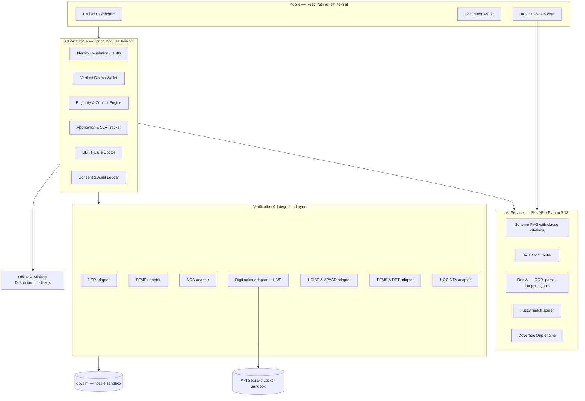
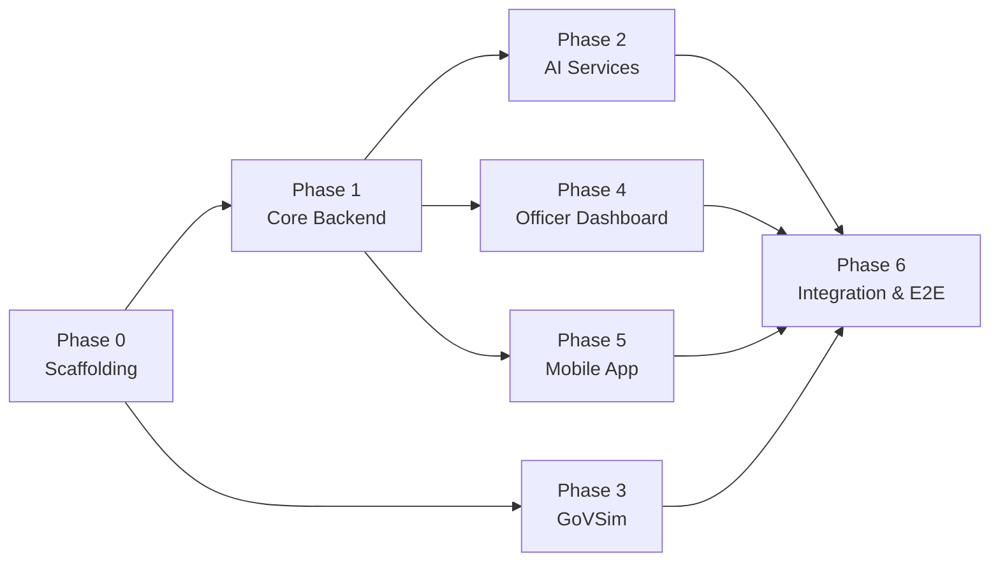

# 🚀 Adi-Vritti — Code Execution Plan for Kilo Code Agent

> **Project:** SIH 2026 · PS 26238 — Unified Scholarship App for Tribal Students
> **Team Codename:** Adi-Vritti (आदि-वृत्ति)
> **Tagline:** One student. One identity. Five schemes.

---

## 📋 Table of Contents

1. [Project Summary](#1-project-summary)
2. [Architecture Overview](#2-architecture-overview)
3. [Tech Stack](#3-tech-stack)
4. [Repository Structure](#4-repository-structure)
5. [Execution Phases](#5-execution-phases)
6. [Phase 0 — Scaffolding & Infrastructure](#phase-0--scaffolding--infrastructure)
7. [Phase 1 — Core Backend (Spring Boot)](#phase-1--core-backend-spring-boot)
8. [Phase 2 — AI Services (FastAPI)](#phase-2--ai-services-fastapi)
9. [Phase 3 — GoVSim Mock Services](#phase-3--govsim-mock-services)
10. [Phase 4 — Officer Dashboard (Next.js)](#phase-4--officer-dashboard-nextjs)
11. [Phase 5 — Mobile App (React Native)](#phase-5--mobile-app-react-native)
12. [Phase 6 — Integration & E2E](#phase-6--integration--e2e)
13. [Frontend UI Component Library](#7-frontend-ui-component-library)
14. [Non-Negotiable Rules](#8-non-negotiable-rules)
15. [Agent Task Queue](#9-agent-task-queue)

---

## 1. Project Summary

Adi-Vritti unifies **5 MoTA scholarship schemes** (Pre-Matric, Post-Matric, Top Class, NFST via SFMP, NOS) spread across **3 disconnected portals** (NSP, SFMP, NOS) into a single app for **Scheduled Tribe students**. The core engineering challenges are:

| Challenge | Solution Layer |
|---|---|
| No common key across 3 portals | **USID** — 3-stage identity resolution |
| Same certificates re-uploaded yearly | **Verified Claims Wallet** — verify once, reuse |
| Opaque verification status | **Verification Orchestrator** — 4 tiers, provenance records |
| Hardcoded eligibility rules break | **Eligibility Engine** — rules as versioned JSON data |
| "Payment failed" with no reason | **DBT Failure Doctor** — decoded PFMS rejection codes |
| 35–55% of ST students missing | **Coverage Gap Engine** — privacy-preserving cross-ministry join |
| JAGO chatbot already exists | **JAGO+ Scholarship Skill** — tool-calling, not a competing bot |

---

## 2. Architecture Overview



---

## 3. Tech Stack

| Layer | Technology | Notes |
|---|---|---|
| **Mobile** | React Native + Expo, TypeScript | Offline-first, target Android 9 / 2GB RAM |
| **Local store** | expo-sqlite + Drizzle, MMKV, TanStack Query | Outbox pattern, delta sync |
| **Scanning** | react-native-vision-camera + ML Kit | On-device OCR, zero network |
| **Core backend** | Spring Boot 3 / Java 21, PostgreSQL, Redis | Records for DTOs, no Lombok |
| **AI services** | FastAPI / Python 3.13, pgvector | RAG, doc parsing, match scoring |
| **GoVSim** | Node.js + Express | Hostile mock government systems |
| **Officer dashboard** | **Next.js 15 + shadcn/ui + Premium UI effects** | See [UI Component Library](#7-frontend-ui-component-library) |
| **Auth** | JWT + OTP (demo); DigiLocker OAuth (live) | No Aadhaar auth — not a KUA |
| **Files** | MinIO (S3-compatible), client-side encrypted | |
| **Queue** | Redis Streams | Verification jobs, retries |
| **Signing** | Ed25519 JWS | Claim attestations |
| **Language** | Bhashini ULCA REST | ASR / NMT / TTS |

---

## 4. Repository Structure

```
adi-vritti/
├── docs/
│   ├── specs/              # Specs BEFORE code — agent generates from these
│   │   ├── 00-overview.md
│   │   ├── demo-path.md
│   │   └── govsim-contracts.md
│   ├── openapi/
│   │   └── core.yaml       # THE CONTRACT — single source of truth
│   └── adr/                # Architecture Decision Records
├── apps/
│   ├── mobile/             # React Native + Expo
│   └── officer-web/        # Next.js dashboard
├── services/
│   ├── core/               # Spring Boot: USID, claims, eligibility, apps, consent
│   ├── ai/                 # FastAPI: RAG, doc AI, match scorer, gap
│   └── govsim/             # Mock NSP, SFMP, NOS, UDISE+, APAAR, PFMS, UGC-NTA
├── packages/
│   ├── api-client/         # Auto-generated from openapi/core.yaml — NEVER hand-edit
│   └── rules/              # Scheme rule JSON, versioned by academic year
├── data/
│   └── synthetic/          # Generator + fixed seed — deterministic, reproducible
├── infra/
│   └── docker-compose.yml  # Postgres, Redis, MinIO, govsim — one command to boot
├── Makefile                # dev, test-core, test-ai, e2e, api, seed
└── Agent.md                # Agent instructions (already exists)
```

---

## 5. Execution Phases

> [!IMPORTANT]
> Each phase is designed so the agent can execute tasks **in the listed order**. Dependencies flow top-down. Tasks within a phase can be parallelized where indicated.



---

## Phase 0 — Scaffolding & Infrastructure

> **Goal:** `docker-compose up` boots everything. Contract frozen v1. Synthetic data ready.

### Task 0.1 — Project Root & Tooling
```
Agent Prompt:
"Create the adi-vritti monorepo root with:
- Makefile with targets: dev, test-core, test-ai, e2e, api, seed
- .gitignore for Java, Python, Node, React Native
- .editorconfig (2-space indent for TS/JS/YAML, 4-space for Java/Python)
- Root package.json with workspaces pointing to apps/* and packages/*
- pnpm-workspace.yaml
- Agent.md (copy existing content)
"
```

### Task 0.2 — Docker Infrastructure
```
Agent Prompt:
"Create infra/docker-compose.yml with these services:
- postgres:16 (port 5432, volume-mounted, init script creates 'adivritti' DB)
- redis:7 (port 6379)
- minio (port 9000, 9001 console, auto-create 'documents' bucket)
- govsim (builds from services/govsim, port 4000)
- core (builds from services/core, port 8080, depends_on postgres/redis)
- ai (builds from services/ai, port 8000, depends_on postgres)
Add a docker-compose.override.yml for dev with volume mounts.
"
```

### Task 0.3 — OpenAPI Contract (core.yaml)
```
Agent Prompt:
"Create docs/openapi/core.yaml — the single source of truth API contract.
Define these endpoints with full request/response schemas:

POST   /v1/identity/resolve         — Returns USID + linked system records + confidences
GET    /v1/scholars/{usid}/dashboard — Powers the home screen (schemes, SLA, money, actions)
POST   /v1/verify                    — Claim verification through tiered orchestrator
GET    /v1/scholars/{usid}/claims    — Verified Claims Wallet with validity windows
POST   /v1/eligibility/evaluate      — Per-scheme verdict, reasons, missing items
GET    /v1/applications/{id}/timeline — Stage history, current actor, SLA state
GET    /v1/disbursements/{usid}      — Payments, DBT status, decoded failure reason
POST   /v1/jago/tool/{name}          — Tool surface JAGO calls
POST   /v1/consent                   — Grant consent artefact
DELETE /v1/consent/{id}              — Revoke consent
GET    /v1/admin/coverage-gap        — Hashed-key gap query by geography
GET    /v1/admin/exceptions          — Manual-review queue

Use schemas:
- Money in integer paise
- Dates as ISO-8601 with explicit zone
- Aadhaar as reference keys only, NEVER plaintext
- Conventional error responses with error codes
"
```

### Task 0.4 — API Client Generation
```
Agent Prompt:
"Set up packages/api-client/ with:
- openapi-generator-cli config for TypeScript-fetch client
- openapi-generator-cli config for Java client (Spring RestClient)
- Build script that reads docs/openapi/core.yaml and generates both clients
- Add to Makefile 'api' target
- Add a .gitignore note: this folder is auto-generated, never hand-edit
"
```

### Task 0.5 — Synthetic Data Generator
```
Agent Prompt:
"Create data/synthetic/ with a seeded data generator (Python script):
- Fixed seed for reproducibility during judging
- Generate:
  * 50,000 ST students across 4 states, 12 districts, ~300 schools (UDISE+/APAAR)
  * 18,000 NSP applications across Pre-Matric, Post-Matric, Top Class
  * 400 SFMP/NFST fellowship records
  * 60 NOS records across 3 selection years
  * 1,200 deliberate identity puzzles (name variants, transliteration)
  * 40 duplicate beneficiaries
  * 900 failed disbursements across full PFMS rejection-code taxonomy
- Output: CSV files + SQL insert scripts + JSON fixtures
- Use faker with Indian locale for names, Indic transliteration variants
- Add to Makefile 'seed' target
"
```

### Task 0.6 — Scheme Rules as Data
```
Agent Prompt:
"Create packages/rules/ with versioned scheme rule JSON files:
- rules/2026-27/pre-matric.json
- rules/2026-27/post-matric.json
- rules/2026-27/top-class.json
- rules/2026-27/nfst.json
- rules/2026-27/nos.json
- rules/2026-27/compatibility-matrix.json

Each rule file follows this schema:
{
  scheme, academic_year, category (merit/welfare),
  rules: [{ claim, op (in/lte/gte/eq/exists), value, onFail }],
  award_cap: { total, pvtg_reserved }
}

Compatibility matrix: merit + welfare allowed from AY 2026-27 per NSP notice.
"
```

---

## Phase 1 — Core Backend (Spring Boot)

> **Goal:** USID resolver, Claims Wallet, Verification Orchestrator, Eligibility Engine, SLA Tracker, DBT Doctor, Consent Ledger — all wired and tested.

### Task 1.1 — Spring Boot Project Setup
```
Agent Prompt:
"Initialize services/core/ as a Spring Boot 3 project with Java 21:
- Spring Web, Spring Data JPA, Spring Data Redis, Spring Security, Spring Validation
- PostgreSQL driver, Flyway for migrations
- Testcontainers for integration tests
- Use Java records for all DTOs — NO Lombok
- application.yml with profiles: dev, test, prod
- Dockerfile (multi-stage build)
"
```

### Task 1.2 — Database Schema (Flyway Migrations)
```
Agent Prompt:
"Create Flyway migrations for the core data model:

Tables:
- scholar (usid UUID PK, demographics JSONB, guardian_usid FK nullable)
- scholar_system_link (usid FK, system_name, external_id, match_confidence, resolution_method, linked_at)
- claim (id UUID PK, usid FK, claim_type, value_encrypted, source, method, confidence, verified_at, valid_until, evidence_ref, verifier)
- claim_attestation (id UUID PK, claim_id FK, jws_token TEXT, public_key_id, revoked_at nullable)
- application (id UUID PK, usid FK, scheme, academic_year, stage, current_actor, sla_deadline, created_at)
- application_event (id BIGSERIAL PK, application_id FK, stage, actor, timestamp, notes — APPEND-ONLY)
- deficiency (id UUID PK, application_id FK nullable, usid FK, type, message, resolution_route, status, created_at)
- disbursement (id UUID PK, usid FK, scheme, sanctioned_amount_paise BIGINT, paid_amount_paise BIGINT, pfms_ref, failure_code, failure_reason, disbursed_at)
- consent_artefact (id UUID PK, usid FK, purpose, scope, granted_by, granted_at, expires_at, revoked_at nullable)
- access_audit (id BIGSERIAL PK, usid FK, accessor, field_accessed, consent_id FK, accessed_at — APPEND-ONLY)
- scheme_rule_version (id UUID PK, scheme, academic_year, rules_json JSONB, created_at)
- coverage_candidate (id UUID PK, hashed_key, state, district, block, school, class_level, gender, pvtg_status, outreach_status)

Rules:
- Money stored as integer paise (BIGINT)
- Dates as TIMESTAMPTZ
- Aadhaar NEVER in plaintext — only reference keys
- Append-only tables have no UPDATE/DELETE
"
```

### Task 1.3 — USID Identity Resolution Service
```
Agent Prompt:
"Implement the 3-stage USID resolver in services/core:

1. Deterministic — match on OTR (14-digit) or Aadhaar reference key → confidence 1.0
2. Probabilistic — weighted score:
   - Jaro-Winkler on normalised names (with Indic transliteration folding: Meena/Mina/मीना)
   - Exact-or-null on DOB, gender, guardian name, institution code, bank last-4, district
   - Fellegi-Sunter style weights
3. Human adjudication — scores 0.60–0.90 go to officer review queue

Output: USID + scholar_system_link entries with confidence & provenance.
Side-effect: Duplicate beneficiary detection across systems.

Endpoint: POST /v1/identity/resolve
Tests: precision/recall on synthetic identity puzzles
"
```

### Task 1.4 — Verified Claims Wallet
```
Agent Prompt:
"Implement the Claims Wallet:
- Claim CRUD with validity windows
- Claims are typed: identity, st_status, income, domicile, academic, enrolment, institution, net_jrf, disability, bank_account
- Once verified, a claim is reusable across all 5 schemes until expiry
- Renewal flow: if all claims valid → zero-document, one-tap confirmation
- Field-level encryption for claim values

Endpoints:
  GET /v1/scholars/{usid}/claims
  POST /v1/verify (delegates to Verification Orchestrator)
"
```

### Task 1.5 — Verification Orchestrator
```
Agent Prompt:
"Implement the 4-tier Verification Orchestrator:

POST /v1/verify — accepts claim_type + subject USID

Tier 1: Authoritative API call → 'gov-verified'
Tier 2: Cross-system corroboration (2 independent systems agree) → 'corroborated'
Tier 3: Doc AI (OCR, field extraction, tamper signals) → 'assisted'
Tier 4: Manual review queue with pre-filled officer worksheet → 'pending-review'

Rules:
- A failure NEVER blocks the applicant — creates a deficiency instead
- Every attempt writes an immutable provenance record to the audit ledger
- Every mismatch produces an actionable deficiency with a resolution route
- Circuit breakers per adapter, retries with jitter, idempotency keys
- Response cache with per-claim TTL
- 'verification pending — source unavailable' states

Strategy chain is configurable per claim type.
"
```

### Task 1.6 — Eligibility & Conflict Engine
```
Agent Prompt:
"Implement the Eligibility Engine:

POST /v1/eligibility/evaluate — evaluates all 5 schemes for a USID

- Load rules from packages/rules/ (versioned by academic year)
- Evaluate each rule against the Claims Wallet
- Return per scheme: Eligible / Not eligible / Need one more thing
- Include exact missing item + 'what changes if' simulator
- Compatibility matrix: merit + welfare scheme combinations from AY 2026-27
- Rules are DATA, not code — a ceiling change is a config edit, not a release

Return reasons, not just booleans.
"
```

### Task 1.7 — Application & SLA Tracker
```
Agent Prompt:
"Implement the Application state machine with SLA tracking:

Stages: submitted → institute_verification → district_nodal → state_dept → ministry → pfms_payment → disbursed
Each stage has an SLA deadline per actor.

GET /v1/applications/{id}/timeline — stage history, current actor, SLA state, days elapsed
Student sees: pending actor + days vs SLA + escalate button
Officer sees: aging queue sorted by breach risk

All transitions are append-only events in application_event.
"
```

### Task 1.8 — DBT Failure Doctor
```
Agent Prompt:
"Implement the DBT Failure Doctor:

GET /v1/disbursements/{usid} — with decoded failure reasons

Build a failure-reason taxonomy mapping PFMS/SFMP/NPCI rejection codes to:
- Plain-language cause
- Concrete fix
- Nearest place to fix it

Example mappings:
- Aadhaar not seeded → show nearest bank branch, draft request
- Account dormant → 'One deposit reactivates it'
- IFSC changed (bank merger) → show new IFSC, 1-tap update
- Name mismatch → show both strings, differing token, correction route
- Sanction issued but funds not released → show sanction order, PFMS stage, escalation
"
```

### Task 1.9 — Consent & Audit Ledger
```
Agent Prompt:
"Implement DPDP-compliant consent management:

- Guardian-linked family accounts (Pre-Matric = minors = verifiable parental consent required)
- Purpose-bound consent artefacts with expiry
- Per-fetch DigiLocker consent, not blanket access
- One-tap revocation
- 'Who looked at my data' audit trail (append-only access_audit table)
- Aadhaar Data Vault pattern — reference keys only

POST /v1/consent — grant consent
DELETE /v1/consent/{id} — revoke
GET /v1/scholars/{usid}/audit — who accessed what, when, under which consent
"
```

---

## Phase 2 — AI Services (FastAPI)

> **Goal:** RAG, Doc AI, fuzzy matcher, coverage gap — all behind clean HTTP APIs.

### Task 2.1 — FastAPI Project Setup
```
Agent Prompt:
"Initialize services/ai/ as a FastAPI project with Python 3.13:
- pydantic v2 for all models
- ruff for linting
- pgvector extension for embeddings
- Dockerfile
- pyproject.toml with dependencies
- Test setup with pytest + httpx
"
```

### Task 2.2 — Scheme RAG with Clause Citations
```
Agent Prompt:
"Build the Scheme Knowledge RAG system:
- Ingest official scheme guideline PDFs (Pre-Matric, Post-Matric, Top Class, NFST, NOS)
- Chunk, embed, store in pgvector
- Query endpoint that returns answers WITH clause citations
- NEVER invent eligibility rules — ground every answer in the actual guideline text
"
```

### Task 2.3 — JAGO+ Tool Router
```
Agent Prompt:
"Build the JAGO+ scholarship skill — tool-calling surface for JAGO chatbot:

Tools (function-calling, MCP-ready):
- get_my_applications
- check_eligibility
- explain_deficiency
- why_is_payment_pending
- next_action
- list_required_documents
- get_disbursement_history

CRITICAL RULE: Factual status answers are TEMPLATE-FILLED from tool output,
NEVER free-generated. The LLM decides which tool to call and how to phrase
empathetically; it NEVER decides what the scholarship status IS.

POST /v1/jago/tool/{name}
"
```

### Task 2.4 — Doc AI (OCR, Parse, Tamper Signals)
```
Agent Prompt:
"Build the Doc AI service:
- OCR with field extraction from Indian government documents
- Issuer-format validation (certificate templates)
- Checksum verification
- Tamper signal detection
- Works with the Verification Orchestrator Tier 3
"
```

### Task 2.5 — Fuzzy Match Scorer
```
Agent Prompt:
"Build the probabilistic identity matching scorer:
- Jaro-Winkler on normalised names
- Indic transliteration folding (Meena/Mina/मीना)
- Weighted scoring across: name, DOB, gender, guardian, institution, bank last-4, district
- Returns confidence score + breakdown
- Used by the USID resolver (Phase 1, Task 1.3)
"
```

### Task 2.6 — Coverage Gap Engine
```
Agent Prompt:
"Build the Coverage Gap analytics engine:

Left-anti-join: ST enrolment (UDISE+/APAAR) vs NSP OTR + application records

Privacy-preserving approach:
- Both sides compute HMAC of Aadhaar reference number under shared, per-purpose, rotating salt
- Only hashed keys exchanged — no raw PII transfer
- MoTA receives counts + school-level lists, NOT another ministry's student DB

Slice by: state, district, block, school, class, gender, PVTG status

GET /v1/admin/coverage-gap — with geography filters
"
```

---

## Phase 3 — GoVSim Mock Services

> **Goal:** Realistic, hostile mock government endpoints that prove resilience is real.

### Task 3.1 — GoVSim Server
```
Agent Prompt:
"Create services/govsim/ as a Node.js + Express server mocking 7 government systems:

1. NSP — SOAP-ish XML responses, OTR-based lookup
2. SFMP (Canara Bank) — flat CSV-in-JSON, fellowship records
3. NOS — paginated records with DIFFERENT date format per page
4. UDISE+ / APAAR — student enrolment data, AISHE codes
5. PFMS / DBT — payment status, rejection codes (full taxonomy)
6. UGC-NTA — NET/JRF results
7. DigiLocker proxy — for when API Setu sandbox is down

Injectable chaos (via header or config):
- 8% HTTP 500s
- 1.5–4s latency spikes
- Occasional truncated payloads
- Rate limit at 20 RPM

Deliberately dirty data:
- Name variants across systems
- Missing Aadhaar on legacy rows
- Same human in 2 systems under 2 spellings
- Genuine duplicate beneficiaries
- Students in UDISE+ with no NSP record

Document every quirk in docs/specs/govsim-contracts.md
"
```

---

## Phase 4 — Officer Dashboard (Next.js)

> **Goal:** A visually stunning, institutional-grade dashboard with premium UI effects.

### Task 4.1 — Next.js Project Setup
```
Agent Prompt:
"Initialize apps/officer-web/ as a Next.js 15 App Router project:
- TypeScript strict mode, no 'any'
- Tailwind CSS v4
- shadcn/ui CLI initialized with 'new-york' style
- Framer Motion for animations
- TanStack Table v9 for data tables
- Recharts 3 for charts
- Auto-generated API client from packages/api-client/
"
```

### Task 4.2 — Dashboard Layout & Navigation
```
Agent Prompt:
"Build the officer dashboard layout:
- Persistent sidebar with glassmorphism effect (frosted glass, backdrop-blur)
- Animated page transitions using Framer Motion
- Dark/light mode toggle
- Responsive — works on tablet for field officers

Sidebar sections:
- 🏠 Overview (STP scores, queue counts)
- 📋 Exception Queue (manual review)
- 🗺️ Coverage Gap Map
- 👥 Identity Resolution Queue
- 💰 Disbursement Tracker
- ⚙️ Settings

Use premium UI components from the component library (see Section 7).
"
```

### Task 4.3 — Exception Queue Page
```
Agent Prompt:
"Build the officer Exception Queue page:
- TanStack Table with sortable columns: student name, scheme, stage, SLA status, risk score
- Queue sorted by breach risk (delay-risk score from stage timestamps)
- STP (Straight-Through Processing) score badge per application
- One-click approve for STP-eligible files (all Tier-1 verified, all rules pass)
- Side panel: student details, claim verification status, auto-generated justification
- Liquid glass card design for the detail panel
- Staggered row entrance animations
"
```

### Task 4.4 — Coverage Gap Map
```
Agent Prompt:
"Build the Coverage Gap visualization:
- Interactive India map (D3.js or react-simple-maps) with drill-down: State → District → Block → School
- Heat map coloring by coverage percentage
- Sidebar with school-level actionable lists
- Example: 'Govt HS Bichhiya, Mandla: 47 ST students Class IX, 6 applications'
- Export to CSV for district officers
- Animated transitions on drill-down
"
```

### Task 4.5 — Identity Resolution Queue
```
Agent Prompt:
"Build the human adjudication queue for identity resolution:
- Side-by-side diff view of two candidate records
- Highlight matching/mismatching fields
- Confidence score visualization (animated progress ring)
- One-click: 'Same Person' / 'Different Person'
- Decisions feed back as training signal
- Glassmorphic card design with subtle hover effects
"
```

### Task 4.6 — Disbursement Tracker
```
Agent Prompt:
"Build the disbursement tracking page:
- Summary cards: total sanctioned, paid, pending, failed (animated counters)
- Failure breakdown chart (Recharts bar chart by rejection code category)
- Drill-down table with decoded failure reasons
- Filter by: scheme, state, district, failure type
- Animated bento grid layout for summary cards
"
```

---

## Phase 5 — Mobile App (React Native)

### Task 5.1 — Expo Project Setup
```
Agent Prompt:
"Initialize apps/mobile/ as a React Native + Expo project:
- Expo dev client (not Expo Go — we need native modules)
- TypeScript strict
- expo-sqlite + Drizzle for local-first store
- MMKV for key-value storage
- TanStack Query with persistence
- react-native-vision-camera + ML Kit text recognition
- Auto-generated API client from packages/api-client/
- Target: Android 9, 2GB RAM
"
```

### Task 5.2 — Unified Student Dashboard
```
Agent Prompt:
"Build the student home screen — one scroll shows everything:
- 'Your scholarships' — all 5 schemes, eligible ones highlighted
- 'Where each file is stuck' — pending actor, days elapsed vs SLA
- '₹12,400 received, ₹4,800 pending' — money tracker
- 'One pending action' — e.g., 'income certificate expired, refetch from DigiLocker'
- Mic button for voice queries (Bhashini)
- Offline-capable: local SQLite store, outbox pattern, delta sync on reconnect

Data comes from: GET /v1/scholars/{usid}/dashboard
"
```

### Task 5.3 — Document Wallet & DigiLocker Integration
```
Agent Prompt:
"Build the Document Wallet screen:
- List of all verified claims with validity windows
- DigiLocker OAuth integration (API Setu sandbox — THIS IS THE LIVE INTEGRATION)
- One-tap refetch for expired documents
- On-device OCR for offline document capture
- Signed local status cache viewable offline
- Encrypted on-device wallet
"
```

### Task 5.4 — JAGO+ Voice & Chat Interface
```
Agent Prompt:
"Build the JAGO+ interface:
- Chat UI for text queries
- Voice button with Bhashini ASR/TTS integration (3 languages minimum)
- Adi Vaani integration for tribal languages (Santali, Gondi)
- Tool-calling under the hood — user sees natural responses
- Status answers are ALWAYS template-filled from tool output
- Offline mode: cached responses, queue queries for when online
- SMS/IVR fallback story documented
"
```

### Task 5.5 — Offline-First Architecture
```
Agent Prompt:
"Implement the offline-first data layer:
- Local-first SQLite store as source of truth for reads
- Outbox pattern for queued submissions
- Delta sync on reconnect
- On-device OCR (zero network)
- Signed local status cache
- Encrypted on-device wallet
- Test on a 2GB RAM Android profile
- Assisted mode: teacher/CSC operator helps batch of students with per-student consent
"
```

---

## Phase 6 — Integration & E2E

### Task 6.1 — DigiLocker Live Integration
```
Agent Prompt:
"Wire up the REAL DigiLocker integration via API Setu sandbox:
- OAuth 2.0 flow
- Pull certificates: caste, income, domicile, academic
- This is the ONE genuinely live integration in the demo
- Test with sandbox sample data
- Record a 20-second screen capture as fallback for demo day
"
```

### Task 6.2 — Bhashini Language Integration
```
Agent Prompt:
"Wire up Bhashini ULCA REST APIs:
- ASR (Automatic Speech Recognition) for voice input
- NMT (Neural Machine Translation) for 22 scheduled languages
- TTS (Text-to-Speech) for voice output
- Minimum 3 languages working: Hindi, English, + 1 tribal language
- Free onboarding — build live
"
```

### Task 6.3 — E2E Demo Path
```
Agent Prompt:
"Create docs/specs/demo-path.md and implement the 5-minute demo script:

Beat 1 (30s): The gap — 2.43 crore enrolled, 35-55% missing, 3 portals
Beat 2 (45s): USID resolver links one student across NSP/SFMP/NOS, catches duplicate
Beat 3 (75s): Live DigiLocker pull → claim verified → reuse across schemes → break with name mismatch → actionable deficiency
Beat 4 (60s): Voice Hindi + tribal language → grounded status → 'why payment stuck' → DBT Doctor fix
Beat 5 (60s): Coverage gap map → hashed-key join → exception queue + STP score
Beat 6 (30s): Integration readiness matrix — what's live, what's contract-ready

Whole demo works with WIFI OFF except DigiLocker beat.
Create make e2e target that runs this path.
"
```

---

## 7. Frontend UI Component Library

> [!TIP]
> The Officer Dashboard is the **visual centerpiece** for judges. Use a layered approach: **shadcn/ui** for core primitives + **premium effect libraries** for visual impact.

### 🎨 Recommended Component Stack

#### Layer 1: Foundation — shadcn/ui
| Component | Usage |
|---|---|
| `Button`, `Input`, `Select` | All form elements |
| `Table` (with TanStack) | Exception queue, disbursement tables |
| `Card` | Base for all data containers |
| `Dialog`, `Sheet` | Detail panels, confirmation modals |
| `Sidebar` | Main navigation |
| `Tabs`, `Accordion` | Content organization |
| `Badge`, `Avatar` | Status indicators |
| `Command`, `Combobox` | Search and navigation |

#### Layer 2: Visual Effects — 21st.dev + React Bits
| Effect | Component | Where to Use |
|---|---|---|
| **Glassmorphism** | `GlassCard`, `FrostedPanel` from 21st.dev (240+ components) | Sidebar, detail panels, stat cards |
| **Liquid Glass** | `FluidGlass`, `LiquidSwap` from React Bits | Hero section, loading states, transitions |
| **Glass Surface** | `GlassSurface` from React Bits | Form containers, modal overlays |
| **Glass Icons** | `GlassIcons` from React Bits | Navigation icons, status indicators |

#### Layer 3: Motion & Animation — Aceternity UI + Magic UI
| Effect | Library | Where to Use |
|---|---|---|
| **Spotlight Effect** | Aceternity UI | Dashboard header, key metrics hover |
| **Bento Grid** | Aceternity / Magic UI | Dashboard overview layout |
| **Animated Counters** | Magic UI | ₹ amounts, application counts, STP scores |
| **Gradient Text** | Magic UI | Section headings, scheme names |
| **Animated Beam** | Magic UI | Data flow visualization |
| **3D Pin Card** | Aceternity UI | Map location markers |
| **Particle Background** | Aceternity UI | Login page, landing hero |
| **Marquee** | Magic UI | Scrolling status updates |

#### Layer 4: Micro-Interactions — Motion Primitives + Hover.dev
| Effect | Library | Where to Use |
|---|---|---|
| **Animated Tabs** | Motion Primitives | Scheme switching (5 schemes) |
| **Staggered Reveals** | Framer Motion | Table row entrance, card grids |
| **Hover Scale** | Hover.dev | Interactive table rows, buttons |
| **Animated Progress** | Hover.dev | SLA progress bars, verification tiers |
| **Smooth Accordion** | Motion Primitives | Expandable student details |
| **Page Transitions** | Framer Motion | App Router layout transitions |

### 📦 Installation Commands
```bash
# Foundation
npx shadcn@latest init
npx shadcn@latest add button card table dialog sheet sidebar tabs badge avatar command

# Animations
npm install framer-motion recharts
npm install @tanstack/react-table

# Premium effects (copy-paste from registries)
# 21st.dev — browse https://21st.dev and copy TSX/Tailwind directly
# React Bits — browse https://reactbits.dev and copy components
# Aceternity — browse https://ui.aceternity.com and copy components
# Magic UI — browse https://magicui.design and copy components
# Motion Primitives — https://motion-primitives.com
# Hover.dev — https://hover.dev
```

### 🎯 Design Direction for Adi-Vritti Dashboard

```
Aesthetic: "Institutional Elegance meets Modern Glass"

Color Palette:
- Primary: Deep Indigo (#312E81) — government authority
- Accent: Saffron (#F59E0B) — Indian identity, warmth
- Surface: Frosted white glass with backdrop-blur-xl
- Dark mode: Deep charcoal (#0F172A) with indigo glass panels
- Status: Emerald (verified), Amber (pending), Rose (failed)

Typography:
- Display: "Plus Jakarta Sans" (bold, modern, institutional)
- Body: "DM Sans" (clean, readable)
- Monospace: "JetBrains Mono" (data, codes)

Effects to prioritize:
1. Glassmorphic sidebar with live backdrop blur
2. Animated counter cards for money tracking (₹ paise → ₹ formatted)
3. Liquid glass transitions on scheme card selection
4. Staggered table row reveals on data load
5. Smooth map drill-down with Framer Motion layout animations
6. SLA progress rings with color transitions (green → amber → red)
7. Spotlight effect on exception queue hover
```

---

## 8. Non-Negotiable Rules

> [!CAUTION]
> These rules are **hardcoded** from Agent.md. The agent MUST follow them without exception.

| Rule | Enforcement |
|---|---|
| `docs/openapi/core.yaml` is the contract | Generate clients; NEVER hand-edit `packages/api-client/` |
| No mock/hardcoded data in `apps/` or `services/core` | All fake data lives behind `services/govsim` |
| No real PII, ever | Test data from `data/synthetic` with fixed seed |
| Aadhaar NEVER in plaintext | Reference keys only (Aadhaar Data Vault pattern) |
| Status answers are template-filled from tool output | LLM NEVER free-generates a status, amount, or eligibility verdict |
| Every verification writes an immutable provenance record | No silent failures |
| A verification failure NEVER blocks an application | It creates a deficiency |
| Money in integer paise | `BIGINT`, not float |
| Dates as ISO-8601 with explicit zone | `TIMESTAMPTZ` in Postgres |
| Java 21, Spring Boot 3, records for DTOs | No Lombok |
| Python 3.13, FastAPI, pydantic v2 | ruff for linting |
| TypeScript strict everywhere | No `any` |

---

## 9. Agent Task Queue

> [!NOTE]
> This is the **ordered execution list** for your Kilo Code agent. Execute top-to-bottom. Tasks marked `[PARALLEL]` can run simultaneously.

```
┌─────────────────────────────────────────────────────────┐
│ PHASE 0 — SCAFFOLDING                                   │
├─────────────────────────────────────────────────────────┤
│ ✅ Task 0.1  Project Root & Tooling                     │
│ ✅ Task 0.2  Docker Infrastructure                      │
│ ✅ Task 0.3  OpenAPI Contract (core.yaml)               │
│ ✅ Task 0.4  API Client Generation                      │
│ ✅ Task 0.5  Synthetic Data Generator                   │
│ ✅ Task 0.6  Scheme Rules as Data                       │
├─────────────────────────────────────────────────────────┤
│ PHASE 1 — CORE BACKEND                [AFTER Phase 0]  │
├─────────────────────────────────────────────────────────┤
│ ✅ Task 1.1  Spring Boot Project Setup                  │
│ ✅ Task 1.2  Database Schema (Flyway)                   │
│ ✅ Task 1.3  USID Identity Resolution                   │
│ ✅ Task 1.4  Verified Claims Wallet                     │
│ ✅ Task 1.5  Verification Orchestrator                  │
│ ✅ Task 1.6  Eligibility & Conflict Engine              │
│ ✅ Task 1.7  Application & SLA Tracker                  │
│ ✅ Task 1.8  DBT Failure Doctor                         │
│ ✅ Task 1.9  Consent & Audit Ledger                     │
├─────────────────────────────────────────────────────────┤
│ PHASE 2 — AI SERVICES          [AFTER Phase 0]         │
│                                 [PARALLEL with Phase 1] │
├─────────────────────────────────────────────────────────┤
│ ✅ Task 2.1  FastAPI Project Setup                      │
│ ✅ Task 2.2  Scheme RAG + Citations                     │
│ ✅ Task 2.3  JAGO+ Tool Router                          │
│ ✅ Task 2.4  Doc AI (OCR, Parse, Tamper)                │
│ ✅ Task 2.5  Fuzzy Match Scorer                         │
│ ✅ Task 2.6  Coverage Gap Engine                        │
├─────────────────────────────────────────────────────────┤
│ PHASE 3 — GOVSIM               [AFTER Phase 0]         │
│                                 [PARALLEL with Phase 1] │
├─────────────────────────────────────────────────────────┤
│ ✅ Task 3.1  GoVSim Server (7 hostile mocks)            │
├─────────────────────────────────────────────────────────┤
│ PHASE 4 — OFFICER DASHBOARD    [AFTER Phase 1]         │
├─────────────────────────────────────────────────────────┤
│ ✅ Task 4.1  Next.js Project Setup                      │
│ ✅ Task 4.2  Dashboard Layout & Navigation              │
│ ✅ Task 4.3  Exception Queue Page                       │
│ ✅ Task 4.4  Coverage Gap Map                           │
│ ✅ Task 4.5  Identity Resolution Queue                  │
│ ✅ Task 4.6  Disbursement Tracker                       │
├─────────────────────────────────────────────────────────┤
│ PHASE 5 — MOBILE APP           [AFTER Phase 1]         │
│                                 [PARALLEL with Phase 4] │
├─────────────────────────────────────────────────────────┤
│ ✅ Task 5.1  Expo Project Setup                         │
│ ✅ Task 5.2  Unified Student Dashboard                  │
│ ✅ Task 5.3  Document Wallet + DigiLocker               │
│ ✅ Task 5.4  JAGO+ Voice & Chat                         │
│ ✅ Task 5.5  Offline-First Architecture                 │
├─────────────────────────────────────────────────────────┤
│ PHASE 6 — INTEGRATION          [AFTER Phase 1-5]       │
├─────────────────────────────────────────────────────────┤
│ ✅ Task 6.1  DigiLocker Live Integration                │
│ ✅ Task 6.2  Bhashini Language Integration              │
│ ✅ Task 6.3  E2E Demo Path                              │
└─────────────────────────────────────────────────────────┘
```

### Execution Time Estimates

| Phase | Estimated Agent Time | Dependencies |
|---|---|---|
| Phase 0 | 2–3 hours | None |
| Phase 1 | 6–8 hours | Phase 0 |
| Phase 2 | 4–5 hours | Phase 0 (parallel with Phase 1) |
| Phase 3 | 2–3 hours | Phase 0 (parallel with Phase 1) |
| Phase 4 | 5–7 hours | Phase 1 (API contract + endpoints) |
| Phase 5 | 5–7 hours | Phase 1 (API contract + endpoints) |
| Phase 6 | 3–4 hours | All previous phases |
| **Total** | **~27–37 hours** | |

---

> [!IMPORTANT]
> **How to use this plan with Kilo Code:**
> 1. Copy each **Task's Agent Prompt** (in the code blocks) directly into Kilo Code
> 2. Execute in the order shown in the task queue
> 3. After Phase 0, Phases 1/2/3 can run in parallel if using multiple agent sessions
> 4. After Phase 1, Phases 4/5 can run in parallel
> 5. Phase 6 requires all previous phases complete
> 6. Each task prompt is self-contained with full context for the agent
